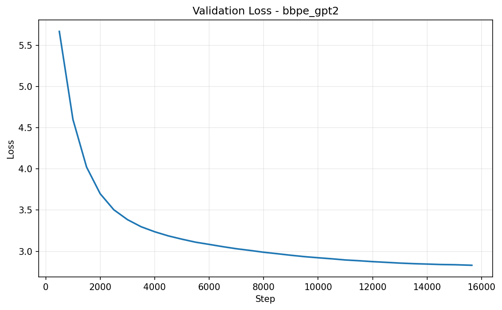
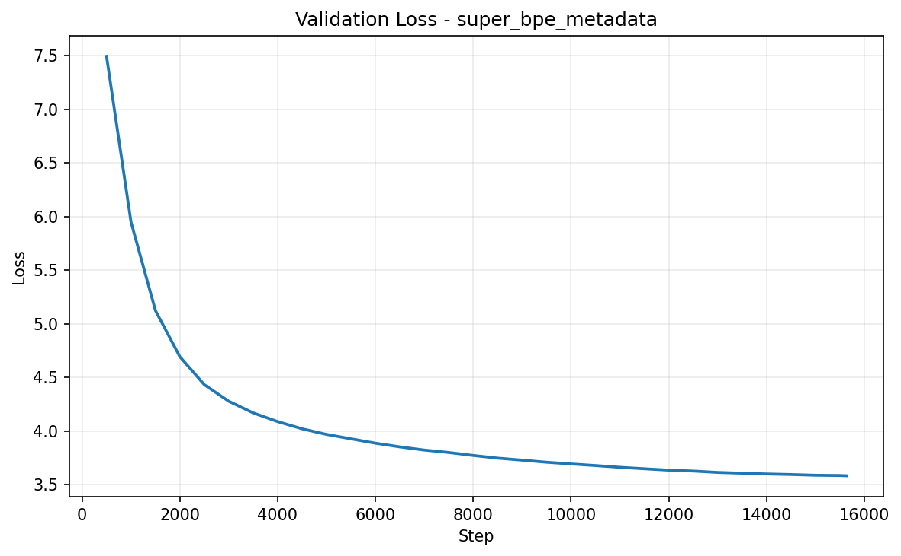

# SLM FineWeb-Edu

Este repositório implementa um pipeline de pré-treinamento para um Small
Language Model decoder-only em FineWeb-Edu. Ele reúne preparação de dados,
tokenização, configuração YAML, treinamento distribuído, avaliação, geração de
plots e inferência a partir de checkpoints locais.

O foco do projeto é comparar o mesmo fluxo de modelo e dados com dois
tokenizadores de vocabulário na faixa de 50K:

- **SuperBPE 50K local**: tokenizador principal treinado neste repositório a
  partir do backend SuperBPE, sem substituição silenciosa por BPE padrão.
- **GPT-2 byte-level BPE**: baseline pronto via `tiktoken`, com `50257` IDs,
  usado para retokenizar o corpus SuperBPE e comparar o impacto da tokenização.

O modelo usa RoPE, Grouped-Query Attention, Flash Attention quando disponível,
SwiGLU, RMSNorm e cabeça de linguagem com embeddings compartilháveis. As
configs principais ficam em `configs/`, os scripts de execução em `scripts/`,
os componentes Python em `src/` e as análises exploratórias em `notebooks/`.

## Documentação

- [docs/architecture.md](docs/architecture.md)
  Explica os blocos do Transformer decoder-only, incluindo RoPE, GQA, Flash
  Attention, SwiGLU, RMSNorm e contagem de parâmetros.

- [docs/configs.md](docs/configs.md)
  Resume a estrutura dos arquivos YAML e o papel das seções `project`,
  `dataset`, `tokenizer`, `model`, `training`, `evaluation`, `logging` e `plots`.

- [docs/dataset.md](docs/dataset.md)
  Descreve o uso do FineWeb-Edu, a meta de tokens, os artefatos processados e o
  fluxo de retokenização para GPT-2 byte-level BPE.

- [docs/distributed_training.md](docs/distributed_training.md)
  Detalha a execução com PyTorch DistributedDataParallel, a divisão por GPUs,
  responsabilidades do rank 0 e pontos comuns de diagnóstico.

- [docs/examples.md](docs/examples.md)
  Centraliza os exemplos de comandos que antes ficavam no README: ambiente,
  tokenização, treino, avaliação, plots, inferência e app Streamlit.

- [docs/how-to-run.md](docs/how-to-run.md)
  Funciona como runbook detalhado do projeto, com ambiente, pipeline completo,
  etapas independentes, campos de configuração e saídas esperadas.

- [docs/running.md](docs/running.md)
  Traz uma versão curta dos modos de execução: pipeline completo, etapas
  independentes, comando DDP e diretório padrão dos plots.

- [docs/results.md](docs/results.md)
  Resume os resultados finais de validação dos modelos SuperBPE e GPT-2
  byte-level BPE, com os gráficos salvos em `plot_images/`.

- [docs/streamlit.md](docs/streamlit.md)
  Documenta a interface Streamlit para amostrar checkpoints locais, incluindo
  instalação, execução, controles da sidebar e problemas comuns.

- [docs/text_generation_examples.md](docs/text_generation_examples.md)
  Mostra exemplos visuais de geração de texto salvos em
  `data/text_generation_examples/`.

- [docs/tokenizer.md](docs/tokenizer.md)
  Explica a preparação do SuperBPE local, os artefatos esperados e a comparação
  com o GPT-2 byte-level BPE.

- [docs/training.md](docs/training.md)
  Documenta o comportamento do treinamento: AdamW, bf16, acumulação de
  gradiente, scheduler, checkpoints, logs JSONL e métricas geradas.

## Notebooks

- [notebooks/tokenizer_eval.ipynb](notebooks/tokenizer_eval.ipynb): compara
  propriedades dos tokenizadores em amostras do FineWeb-Edu.
- [notebooks/processed_metadata_training_plots.ipynb](notebooks/processed_metadata_training_plots.ipynb):
  lê `metadata.json` de diretórios processados e reproduz inline os mesmos
  plots de treino definidos em `src/plotting/training_plots.py`.

## Plots de Loss

### GPT-2 byte-level BPE

### SuperBPE

## Artefatos

Dados processados, checkpoints, corpora de tokenizador e plots gerados devem
permanecer fora do versionamento quando forem grandes. Use as configs de debug
para checagens locais pequenas e só considere uma execução completa quando o
comando de treino tiver terminado de fato.
